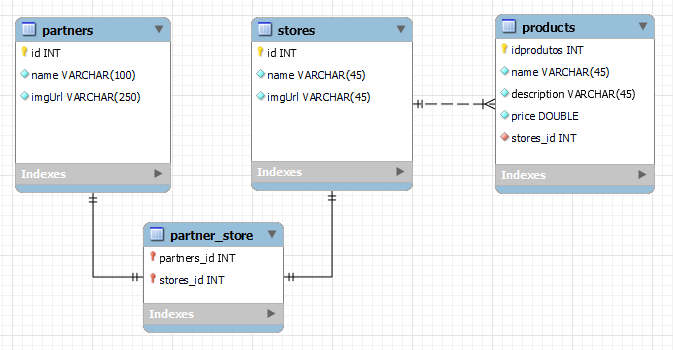
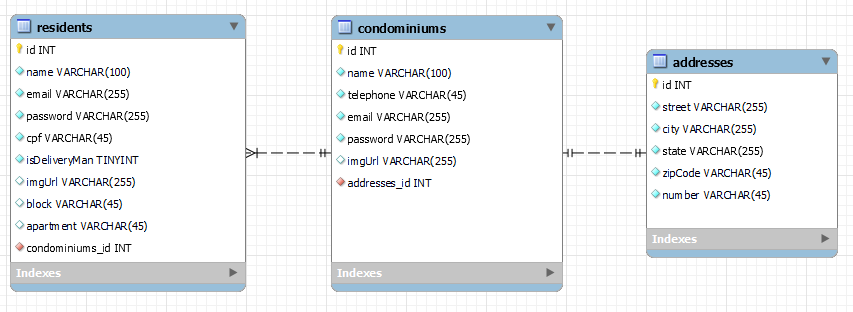

# :package:Condelivery 


<p>Backend do Condelivery, usando arquitetura de microsservicos com SpringBoot.</p>
<p>O Condelivery é um projeto acadêmico de um sistema de entregas exclusivo para condomínios. A solução visa facilitar o recebimento e a gestão de encomendas, oferecendo uma plataforma web e móvel para os moradores.</p>

* [Pitch]()
* [Protótipo](https://www.figma.com/design/JKM6bqd7yQhenKmrgP8qcI/Condelivery?node-id=0-1&node-type=canvas&t=FIJrbOOBgEBK51w3-0)
* [Front-end Mobile](https://github.com/andrade-tiago/condelivery.app)
* [Front-end Web]([https://github.com/EduardoMeireles390/Condelivery](https://github.com/josiastavares/Condelivery-front-web))


## :wrench: Serviços implementados:
- <p><b>ConfigServer</b> </p> 
- <p><b>Config Infra</b> <a href=""> Link do repositorio</a></p>
- <p><b>Discovery</b> </p>
- <p><b>Gateway</b> (com Spring Cloud) </p>
- <p>Micro Serviço de <b>produto </b>:</p>

- <p>Micro Serviço de <b>autenticação</b> </p>
- <p>Micro Serviço de <b>Usuário</b> </p>

- <p>Micro Serviço de <b>pedido</b></p>
- <p>Micro Serviço de <b>pagamento</b> </p>

## :construction: Serviços em andamento:
- <p>Micro Serviço de <b>Entrega</b> </p>
- <p>Micro Serviço de <b>Avaliação</b> </p>
- <p>Micro Serviço de <b>Chat com entregador</b> (Websocket)</p>

## :triangular_ruler: Design Patterns usados:
<p>Data Transfer Objects</p>
<p>Repository Pattern</p>
<p>Service Layer Pattern</p>
<p>Controller</p>


## :gear: Tecnologias:
- **Java 21**: Linguagem de programação principal.
- **Spring Boot**: Framework para simplificação do desenvolvimento de aplicações Java.
- **Spring Security**: Oferece autenticação e autorização em aplicações Java. Ele protege recursos sensíveis, garantindo que apenas usuários autenticados tenham acesso. Suporta autenticação básica, formulários e OAuth 2.0 para login social, além de permitir a utilização de JWT (JSON Web Tokens) para autenticação.
- **Spring Data JPA**: Abstração da camada de persistência que simplifica o uso de JPA para interagir com bancos de dados.
- **Spring Web**: Facilita a construção de aplicações web.
- **Spring WebSockets**: Facilita a construção de aplicações web em tempo real, permitindo comunicação bidirecional entre o cliente e o servidor..
- **Spring Boot DevTools**: Conjunto de ferramentas que melhora a experiência de desenvolvimento com aplicações Spring Boot.
- **Spring Cloud Netflix** (Eureka Server, Discovery...): Ferramentas para integração de microsserviços e registro de serviços, incluindo o Eureka para service discovery (descoberta de serviços)..
- **Spring Cloud Open Feign**: Cliente HTTP declarativo que simplifica a comunicação entre microserviços.
- **Spring Cloud Gateway**:  Framework para roteamento de API e gateway de microsserviços.
- **Maven**: Ferramenta de automação de build e gerenciamento de dependências.
- **Flyway**: Biblioteca para controle de versão do banco de dados (migrations).
- **Lombok**: Biblioteca para geração de código repetitivo (boilerplate).
- **Docker**:  Plataforma para criação e gerenciamento de contêineres.
- **Amazon S3**:  Serviço de armazenamento em nuvem da AWS que permite o armazenamento e recuperação de grandes dados.
- **Amazon RDS** (Relational Database Service -> MySQL): Serviço gerenciado de banco de dados relacional na nuvem.
- **Amazon ECS (Elastic Container Service) com Fargate**: Serviço gerenciado de orquestração de contêineres que permite executar aplicações Docker sem a necessidade de gerenciar a infraestrutura de contêineres subjacente. Hospedagem e gerenciamento dos contêineres que compõem os microserviços do sistema.
- **AWS CloudFormation**:  Serviço da AWS que facilita a modelagem e o provisionamento de todos os recursos de infraestrutura.  Provisionamento e gerenciamento da infraestrutura de nuvem, como instâncias EC2, balanceadores de carga, bancos de dados RDS, redes e outras configurações de infraestrutura.


## 🚀 Instalação e Execução

### Pré-requisitos

- JDK 21 instalado
- Maven instalado

### Passos para rodar o projeto

1. Clone o repositório:

    ```sh
    git clone https://github.com/Bee-Pirez/fiap-condelivery-ms.git
    cd fiap-condelivery-ms
    ```


